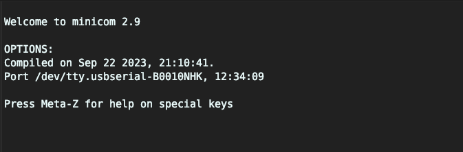
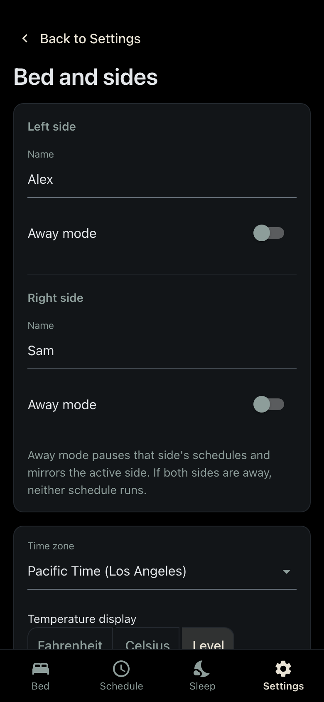

# Requirements

## Which path is yours?

How you install depends on your Pod and on what it runs today.

- **Pod 3 with an SD card:** you get a root shell with a community SD card method (see [Compatibility](#compatibility)), then join this guide at [step 11](#11-disable-software-updates). You don't need the cable or the tools below.
- **Pod 3 without an SD card, Pod 4, or Pod 5:** you open the Pod and connect a cable to its circuit board. Get the tools below, then start at [step 1](#1-access-the-circuit-board).
- **Already running another free-sleep fork:** you don't need to reinstall by hand. See [Switching from another free-sleep fork](#switching-from-another-free-sleep-fork).

I only have a Pod 5, so it's the only Pod I've tested this guide on. The Pod 3 and Pod 4 steps come from the guide in the original project, throwaway31265/free-sleep.

## Compatibility

- Pod 1: not compatible.
- Pod 2: not compatible.
- Pod 3 (with SD card): supported by upstream free-sleep. The SD card method needs a Linux computer.
  - Option 1: follow blopker's [ZeroSleep guide](https://blopker.com/writing/04-zerosleep-1/) to get root.
  - Option 2: use Pixel-Meister's [SD card script](https://github.com/Pixel-Meister/freesleep_script/blob/main/modify_eight_sleep.sh), which modifies the Eight Sleep SD card.
  - Once you can SSH in as root, do [step 11](#11-disable-software-updates) right away. Until you do, the Pod can update its firmware on its own and disconnect you. Then skip step 12 (if SSH works, the Pod is already on your network) and continue from step 13.
- Pod 3 (no SD card): supported by upstream free-sleep. This version has FCC ID 2AYXT61100001, printed on the back of the Pod where the water tubes plug in.
- Pod 4: supported by upstream free-sleep.
- Pod 5: tested by the maintainer. The missing teardown photos and reset procedure are noted below.
- Pod 6: unknown; no Nightstand compatibility report is documented here.

## Tools required

These are for the cable method only (Pod 3 without an SD card, Pod 4, Pod 5). The cable connects your computer to the board's serial console (UART), a text terminal the board exposes for debugging. That's how you interrupt the boot and get a root shell.

- [TC2070-IDC ($50)](https://www.tag-connect.com/product/tc2070-idc): a Tag-Connect cable. Its spring pins press onto pads on the board, so there's nothing to solder. If you'd rather solder, you can attach the three required wires to the JTAG header instead.
- [FTDI FT232RL ($13)](https://www.amazon.com/gp/product/B07TXVRQ7V/): a USB-to-serial adapter. It makes the board's serial pins show up as a USB device on your computer.
- [Dupont wires ($7)](https://www.amazon.com/Elegoo-EL-CP-004-Multicolored-Breadboard-arduino/dp/B01EV70C78): jumper wires to connect the cable to the adapter.

You'll also need an SSH key pair on your computer for [step 18](#18-add-an-ssh-config). If you don't have one, `ssh-keygen` creates it.

These steps are written for Mac and Linux. On Windows you'll need to adapt them yourself.

---

## How to revert changes and go back to using your Eight Sleep through their app

This restores Eight Sleep software, not a previous Nightstand release or
upstream free-sleep. Check the model-specific procedure before installing.
Back up any data you want to keep before resetting. See the
[recovery notes](README.md#what-happens-if-an-install-fails) before starting.

1. If your Pod is still on your Eight Sleep account, open the app, manage the Pod, and remove it from your account.
2. Reset the firmware:
   - [Pod 3](docs/pod_3_teardown/6_firmware_reset.jpeg)
   - [Pod 4](docs/pod_4_teardown/3_reset_firmware.png)
   - Pod 5: not written up here yet.
3. Set up the Pod as a new Pod in the app. Once it's back online it may start a firmware update on its own. That is expected.

---

## Switching from another free-sleep fork

If your Pod already runs a free-sleep fork (the original project, jmew's, or
another), use the migration script instead of reinstalling by hand. It runs on
your computer and connects to the Pod over SSH. Before replacing the app, it
backs up application code and installed dependencies, the SQLite database
and LowDB settings/schedules. It keeps one copy on the Pod and one on your
computer, and checks both archives.
Logs and RAW sensor archives are not included. It then installs Nightstand and
keeps your old application tree for rollback from the app afterward. This
application rollback does not restore the database to its earlier state.

Before you start, check that:

- Your current install's web app is running and reachable from your computer.
  The script looks for the Pod at `eight-pod.local`, offers to scan your local
  network, or takes the address directly with `--ip <address>`.
- You can SSH in as root on port 8822 or 22. The script asks for the root
  password; if you log in with a key instead, leave the prompt blank.
- Your computer (macOS or Linux) has `curl`, `ssh`, `scp`, `tar`, and `python3`.

On your computer:

1. Download the script and the two helper files it copies to the Pod into one
   folder. Saving them rather than piping into `bash` lets you read them first:
   ```bash
   for f in switch-to-this-fork.sh pod-installer.sh restore-original-fork.sh; do
     curl -fO "https://raw.githubusercontent.com/LTimothy/nightstand/main/scripts/migrate/$f"
   done
   chmod +x switch-to-this-fork.sh
   ```
2. Run it once with `--dry-run`. It reports what it found and what it would
   do, without changing anything:
   ```bash
   ./switch-to-this-fork.sh --dry-run
   ```
3. If the report looks right, run it for real:
   ```bash
   ./switch-to-this-fork.sh
   ```
   It asks you to type `switch` before it changes anything. The laptop copy of
   the backup is saved in the folder you run it from; keep it for a few nights.

Pod 5 is the tested case. On a Pod 3 or Pod 4 the script asks for a separate
typed acknowledgment, because sleep tracking there may not work on this fork
(temperature control and scheduling are expected to). If the install fails,
the script attempts to restore your original application automatically.
See the [recovery notes](README.md#what-happens-if-an-install-fails). For
options such as `--restore <backup-tarball>`, run it with `--help`.

When it finishes, the Pod's internet access is blocked with the same rules as
[step 19](#19-add-firewall-rules-to-block-internet-access-optional-but-recommended).
You don't need the numbered steps below, except step 20 if you want remote
access.

---
# Installation steps

Steps 1 to 4 are physical setup or commands on your computer. From step 5,
commands run **on the Pod**, first through the serial console and later over
SSH. Browser and computer steps are labeled separately.

## 1. Access the circuit board

1. Pod 5 only: set up your Pod with the Eight Sleep app first, then continue.
2. Follow the teardown steps for your Pod to reach the circuit board:
   - [Pod 3](docs/pod_3_teardown)
   - [Pod 4](docs/pod_4_teardown) ([written instructions](docs/pod_4_teardown/instructions.md))
   - Pod 5: no teardown photos here yet. If you take some while doing yours, a pull request would be welcome.

---

## 2. Connect to the device

1. Keep the Pod unplugged. It doesn't need to be connected to the mattress cover or to power yet.
2. **Set the FTDI adapter's voltage jumper to 3.3V** before connecting anything ([photo](docs/jtag/4_module_connection.png)). The board's serial pins run at 3.3V, and the 5V setting can damage them. Then connect the Tag-Connect cable to the adapter with Dupont wires, following the images in [docs/jtag/](docs/jtag/).
3. Connect the Tag-Connect cable to the circuit board:
   - [Pod 3](docs/pod_3_teardown/7_pod_3_board_connection.jpeg)
   - [Pod 4](docs/pod_4_teardown/2_circuit_board.png)
4. Plug the FTDI adapter into your computer.

---

## 3. Get minicom ready on your computer

minicom is a terminal program for serial devices. If you don't have it, install it with `brew install minicom` (Mac) or `sudo apt install minicom` (Debian/Ubuntu).

- The baud rate is 921600.
- Find the adapter's device name. Run `ls /dev/tty*` with the adapter unplugged and again with it plugged in; the new entry is the adapter. On a Mac it looks like `tty.usbserial-B0010NHK`. On Linux it's usually `/dev/ttyUSB0`. Put your device's name in place of the one in this command:
  ```bash
  minicom -b 921600 -o -D /dev/tty.usbserial-B0010NHK
  ```
- minicom should open to a screen like this one (taken on a Mac). If it can't open the device, check the name again.



---

## 4. Plug the power into the pod

Plug in the Pod's power and watch minicom. When `Hit any key to stop autoboot` appears, press a key (Ctrl+C works) to interrupt the boot. If you miss it and the Pod keeps booting, unplug the power and try again.

If the Pod's output appears but your key presses do nothing, a common cause is minicom's hardware flow control. Press Ctrl+A, then O, open "Serial port setup", and set Hardware Flow Control to No.


If it worked, you'll see this prompt:


---

## 5. Modify the boot environment

Type these at the bootloader prompt from step 4. They tell the Pod to boot once into a root shell. The change isn't saved, so the reboot in step 9 goes back to a normal boot.

```text
# Verify that current_slot = a. If it isn't, go back and reset your pod's firmware.
# If it's still not a, open an issue on this repository.
printenv current_slot

# If current_slot=a:
setenv bootargs "root=PARTLABEL=rootfs_a rootwait init=/bin/bash"

run bootcmd
```

---

## 6. Mount the file system

You're now in a minimal root shell with nothing mounted. Mount the file systems so you can make changes. The last command makes the root file system writable, so type carefully from here on.

```bash
# Mount /proc for process and system information
mount -t proc proc /proc

# Mount /sys for hardware and system-level information
mount -t sysfs sysfs /sys

# Mount /dev for device files (e.g. /dev/mmcblk0)
mount -t devtmpfs devtmpfs /dev

# Mount /run (optional, but useful for some runtime scripts)
mount -t tmpfs tmpfs /run

# Remount the file system read-write (be careful editing files from here)
mount -o remount,rw /
```

---

## 7. Set the root and rewt passwords

The Pod has two accounts that can log in with full access, root and rewt. Set a password on each. You'll log in as root in step 10. Keep a record of the password: without it or an SSH key, the only way back in is the cable.

```bash
passwd root
passwd rewt
```

---

## 8. Sync the file changes

This writes your changes to disk before the reboot.

```bash
sync
```

---

## 9. Reboot

**Do not interrupt this boot.** Let it start normally.

```bash
reboot -f
```

---

## 10. Log in as root with the password you set

The login prompt appears in minicom once the Pod finishes booting. On Pod 4 and Pod 5 it looks slightly different from this screenshot.


---

## 11. Disable software updates

**Do this as soon as you're logged in, on every path.** Until you do, the Pod can update its firmware on its own and disconnect you.

The first command stops the update and telemetry services and keeps them from starting at boot. The second masks them so nothing else can start them. Not every Pod has all of these services, so errors saying a unit isn't loaded or doesn't exist are expected.

```bash
# Disable the software updates
systemctl disable --now swupdate-progress swupdate defibrillator eight-kernel telegraf vector frankenfirmware dac swupdate.socket

# Block the software updates from starting again on restart or power-on
systemctl mask swupdate-progress swupdate defibrillator eight-kernel telegraf vector frankenfirmware dac swupdate.socket
```

---

## 12. Set up internet access

This connects the Pod to your Wi-Fi. Pod 3 with an SD card: skip this step.

Replace `WIFI_NAME` (it appears twice) and `PASSWORD` with your network's name and password. Use your regular network rather than a guest network. The Pod needs internet access for the next step; if you want to block it afterward, step 19 does that.

```bash
# Replace WIFI_NAME and PASSWORD with your actual Wi-Fi credentials
# (WIFI_NAME appears twice)
#
# Do not use a guest network or try anything fancy to keep the pod off the internet here.
# If you want to block internet access to the pod, we do that with firewall rules later (step 19).

nmcli connection add type wifi con-name WIFI_NAME ifname wlan0 ssid WIFI_NAME wifi-sec.key-mgmt wpa-psk wifi-sec.psk "PASSWORD" ipv4.method auto ipv6.method auto

# Optional: this takes your pod out of the "waiting to be set up" state and lets you turn off the blinking blue LED.
sed -i 's/uuid=.*/uuid=700a7a76-2105-4f46-b1b4-c9f3c791c440/' /persistent/system-connections/*.nmconnection

# Reload the network manager
nmcli connection reload
```

---

## 13. Install the Nightstand server

This downloads `main` (the newest published release, which may be beta),
installs it, and sets up a systemd service
so Nightstand starts on boot. When it finishes you should see `Installation
complete!`. Just before that it prints your dac.sock path. If that path doesn't
end in `dac.sock`, open an issue before going further.

```bash
/bin/bash -c "$(curl -fsSL https://raw.githubusercontent.com/LTimothy/nightstand/main/scripts/install.sh)"
```

If the download fails with a certificate error, check the Pod's clock with
`date`. A clock that is far off breaks HTTPS.

---

## 14. Get your pod's IP address

Run the first command. The line after it is example output, not something to type; yours will show a different address. The Pod's IP address is the part before `/24`.

```bash
# Yours will be different, that's fine
nmcli -g ip4.address device show wlan0
192.168.1.50/24
```

---

## 15. Open the Nightstand web app

From a phone or computer on the same Wi-Fi network as the Pod, open the Pod's IP address on port 3000. With the example address above, that's:

`http://192.168.1.50:3000/`

Nightstand's API has no login: a device that can reach it can control the Pod
and access its data. Use a trusted local network, do not port-forward it to
the public internet, and restrict access if you enable Tailscale.

**Set your time zone under Settings > Bed preferences before using schedules.** The page looks dimmed until the Pod is connected to the mattress cover. That is expected.



---

## 16. Save the Nightstand web app to your home screen

- Apple devices: open the site in Safari, tap the share icon in the bottom toolbar, then "Add to Home Screen". Rename it if you like and tap Add.
- Android devices: open the site in Chrome (or your default browser), tap the three-dot menu in the top-right corner, then "Add to Home screen" (sometimes shown as "Install app"). Rename it if you like and tap Add.

---

## 17. Validation

There are two checks. Do the first one now. The second needs steps 18 and 19, so come back to it after those.

### Verify the site is still up

1. Unplug the Pod's power and plug it back in.
2. Wait up to about four minutes, then open the site from another device.
3. If it loads, Nightstand is starting on boot as it should. It won't fully load until the Pod is connected to the mattress cover.

### Verify the controls work

1. Finish steps 18 and 19 first (SSH access, and the firewall rules).
2. Disconnect the Tag-Connect cable and power from your Pod.
3. Connect your Pod to the cover as you normally would.
4. In the web app, set one side to the highest temperature and the other side to the lowest.
5. Check that the temperature actually changes, by hand or with a thermometer.
6. If it does not, open an issue with your Pod model, Nightstand version and what you observed. `fs-debug`, run on the Pod over SSH, can help. Check it before posting and remove personal or network details you do not want to share.

## 18. Add an SSH config

This sets up SSH so you can reach the Pod without the cable. The script:

- replaces the Pod's SSH server configuration, with SSH on port 8822 and password login for root still allowed;
- deletes the existing authorized keys in `/etc/ssh/authorized_keys`;
- asks you to paste one public key, the contents of a file such as `~/.ssh/id_ed25519.pub` on your computer.

Afterward, connect with `ssh root@<POD_IP> -p 8822`.

If you're running this over SSH rather than the cable (Pod 3 with an SD card), the port or key you used to get in may stop working. Keep your current session open until a new connection on port 8822 succeeds.

```bash
sh /home/dac/free-sleep/scripts/setup_ssh.sh
```

## 19. Add firewall rules to block internet access (optional, but recommended)

The firewall blocks most new internet connections while allowing local access,
established connections and time sync. If Tailscale is running when the
script runs, it also allows outbound UDP, DNS and HTTPS to any host.

Run this on the Pod:

```bash
sh /home/dac/free-sleep/scripts/block_internet_access.sh
```

To undo the rules:

```bash
sh /home/dac/free-sleep/scripts/unblock_internet_access.sh
```

Updates open internet access for downloads and reapply the block afterward,
even if you skipped this step. Rerun the block script after changing Tailscale
setup: start Tailscale first to keep remote access, or stop it first to remove
those broad exceptions. The rules stay in place until reapplied or changed.
Keep the firmware update services disabled as described in step 11.

---

## 20. (Optional) Remote access from outside your home network with Tailscale

Follow [Remote access with Tailscale](docs/REMOTE_ACCESS.md) to install the
daemon, configure HTTPS and restrict access. Start Tailscale before reapplying
the firewall in step 19. Its broad UDP, DNS and HTTPS exceptions are selected
when the script runs and remain until the rules are reapplied or changed.

---

## Nightstand shortcuts

Step 13 installs these. Run them on the Pod as root, over SSH or at the serial console.

- `fs-debug`: prints device/server status, resolver configuration and service logs. Check it before sharing and remove personal or network details you do not want public.
- `fs-restart`: restarts the free-sleep and free-sleep-stream services.
- `fs-reset-db`: deletes the biometrics database and recreates it empty (useful if the database file is corrupted). Asks for confirmation first.
- `fs-reset`: permanently deletes Nightstand's settings, schedules and sleep data in `/persistent/free-sleep-data/`, then starts Nightstand again with empty settings. Backups in `/persistent/free-sleep-backups` and `/persistent/free-sleep-database-backups` are kept; delete them too to remove all sleep data. Asks for confirmation first.
- `fs-update`: selects the newest release allowed by your saved channel preference and uses the same backup and rollback workflow as the app. Stable selects stable releases; beta includes both channels. To choose a channel or specific version, use Settings > Software.
- `fs-dev-server`: stops the Nightstand service and runs the Express server directly with nodemon (for development).
