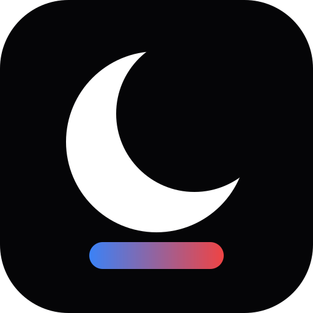
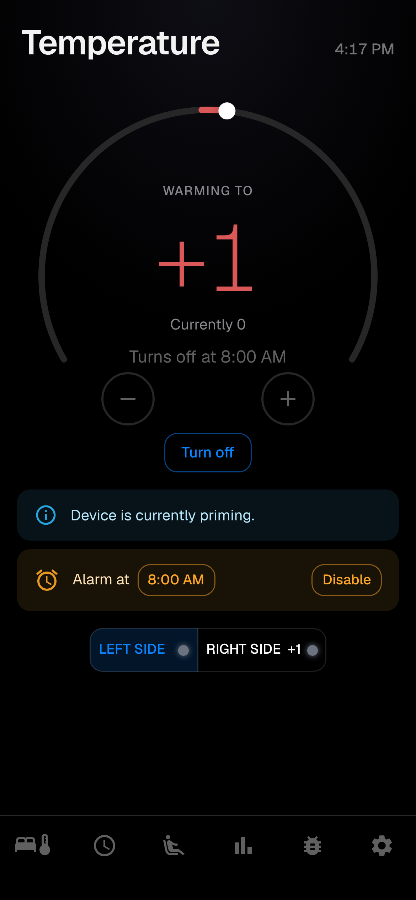
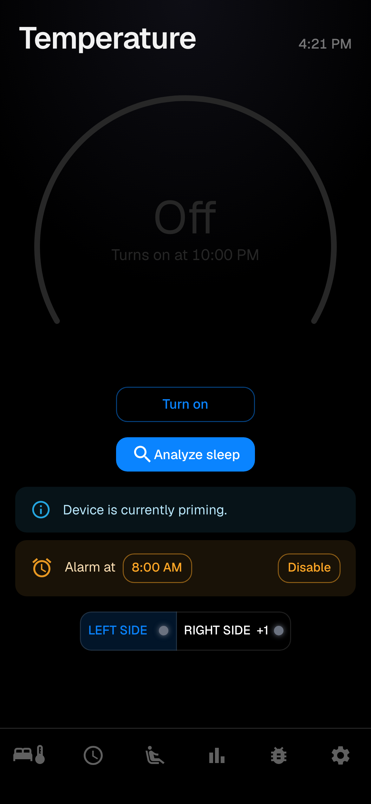
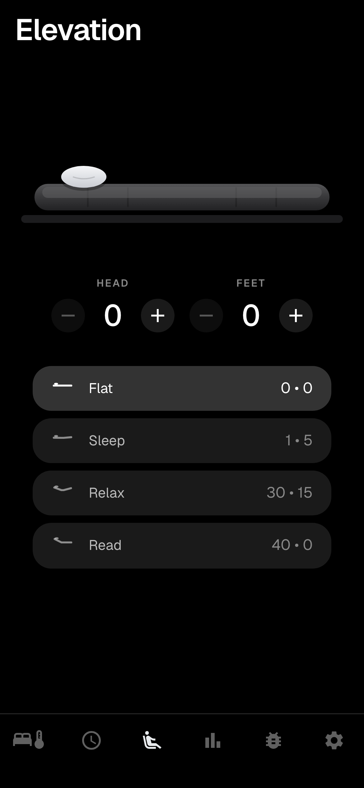
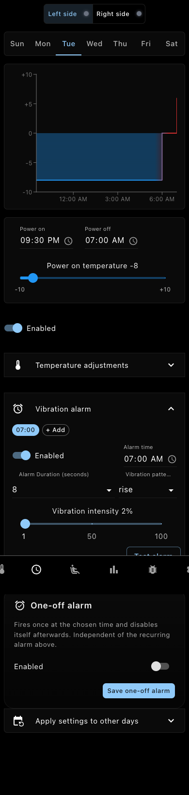
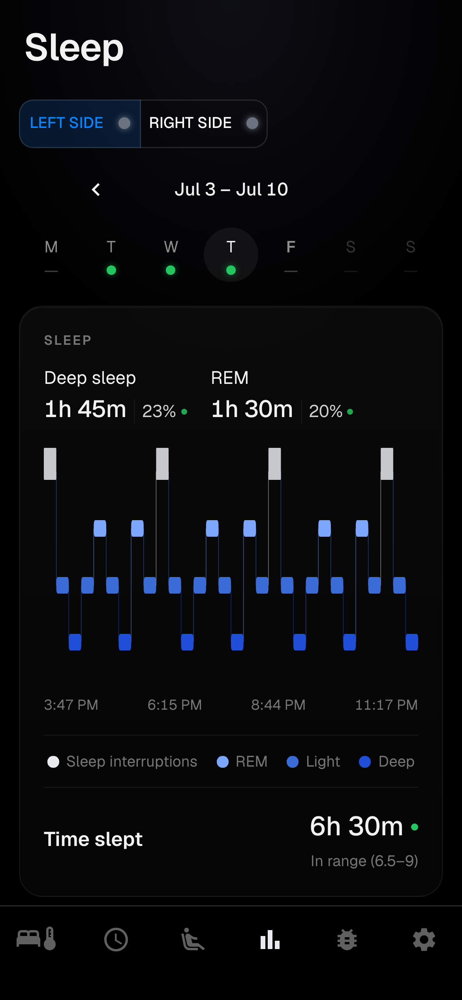
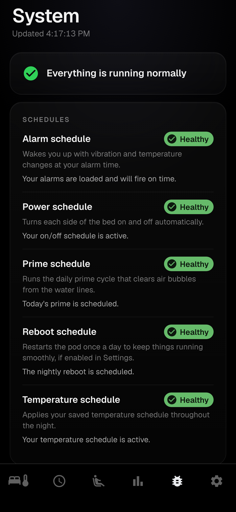
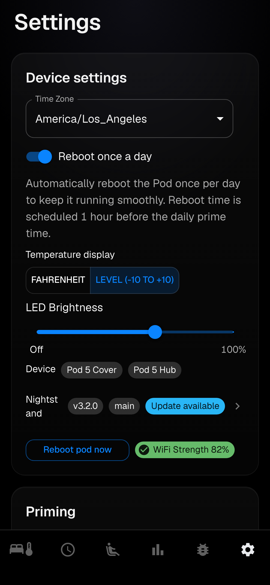

  

<h1 align="center">Nightstand</h1>

<b>Local-first control for Eight Sleep Pods. No cloud, no subscription.</b>

  
  

Every Eight Sleep Pod has a small Linux computer inside it. Nightstand puts a
server on that computer so you control the Pod yourself, from your own
network, without the official app or the cloud.

  
  &nbsp;&nbsp;
  

**[Try the live demo](https://ltimothy.github.io/nightstand/)**, the real
app running against mocked data in your browser, nothing to install.

Nightstand is an independent open-source project. It is not affiliated with,
endorsed by, or supported by Eight Sleep, Inc. "Eight Sleep" and "Pod" are
used here only to describe which devices the software is compatible with.

Nightstand is a fork of
[jmew/free-sleep](https://github.com/jmew/free-sleep), which builds on the
original [throwaway31265/free-sleep](https://github.com/throwaway31265/free-sleep).
Local control of the Pod exists because of that original project, and presence
detection, sleep stages, adjustable base support, and the WebSocket UI came
from jmew's work. Nightstand keeps free-sleep's on-disk layout so it stays
compatible with the other forks' tooling, and the credits below record what
came from where.

## About Nightstand

Nightstand is tuned for running one Pod well, rather than trying to be a
general-purpose platform, and that shows up in a few deliberate choices.

Privacy comes first. The Pod's internet access is blocked at the firewall,
and the firewall script here is written for exactly that setup. The parent
fork's error-reporting integration pointed at an account this fork doesn't
have access to, so it's been removed here rather than sending reports nobody
can read; debugging instead relies on the Pod's own local logs. Version
checks run from your browser rather than the Pod, so the only time the Pod
touches the internet at all is during an update, and the firewall closes
again as soon as the download finishes.

Versions follow their own semver stream starting at 3.0.0 (see
[CONTRIBUTING.md](CONTRIBUTING.md)). `serverInfo.json` tracks `upstreamBase`,
the last release of the original project reviewed for changes worth
cherry-picking. When the original project ships something newer, the app
shows a small note about it, but nothing merges automatically; changes get
reviewed and pulled in deliberately.

Updating happens through the app itself. Once a new build lands on `main`,
the Settings page shows an Update button; pressing it has the Pod pull the
build from GitHub, back itself up, install, and check its own health, rolling
back automatically if anything fails.

If there's no adjustable base connected, the base-control page stays
hidden instead of logging retry errors indefinitely.

## [Installation instructions](./INSTALLATION.md)

---

## Compatibility

| Pod | Compatible |
| --- | --- |
| Pod 1 | ❌ |
| Pod 2 | ❌ |
| Pod 3 (with SD card) | ✅ |
| Pod 3 (no SD card) | ✅ |
| Pod 4 | ✅ |
| Pod 5 | ✅ |

Pod 3 without an SD card is identified by FCC ID `2AYXT61100001`, printed on
the back of the pod near the water tubing.

---
## FAQ
### Is it reversible?
Yes. You can firmware reset the Pod and go back to the official Eight Sleep app.

### Will I brick my pod?
No cases have been reported on Pod 3 **without** the SD card, Pod 4, or
Pod 5, and a firmware reset restores the stock software if an install goes
wrong. As with any unofficial software, you install it at your own risk.

### Will it void my warranty?
Nightstand is not supported by Eight Sleep, so it could affect your warranty.
That said, you can fully reset the firmware and return the Pod to its original
state at any time. There is no permanent modification to the hardware.

## Features
- Complete control of the device without internet access. If you lose
  internet, the Pod keeps working, and you can block its WAN access entirely
  at the firewall.
- Dynamic temperature control with real-time updates, in real Fahrenheit
  degrees or the -10..+10 level scale from the official app, whichever you
  prefer
- Schedule management:
  - Set power on/off times
  - Schedule temperature adjustments
  - Schedule daily time to prime the pod
  - Alarms with vibration patterns and configurable intensity/duration,
    auto-skipped if the pod was turned off before the scheduled time
- Sleep tracking and biometrics dashboard: heart rate, HRV, breathing rate,
  movement, sleep stages, sleep score, sleep consistency
- Adjustable base control (Pod 4+): position presets, manual head/foot
  control, stop command
- Real-time UI updates over WebSocket (`/ws/events`), so temperature changes,
  schedule events, and service-health flips arrive without polling
- In-app updates: the Pod fetches new builds of this fork from GitHub on
  request, with automatic backup and rollback
- Settings customization: timezones, away mode, LED brightness
- Works on desktop and mobile (PWA-installable)

### Biometrics 📈
- **The only biometrics data that has been validated is heart rate.** HRV and
  breathing rates have not been validated and may be inaccurate.
  Heart rates were validated by the original project over 33 sleep periods
  from 3 males and 3 females, mostly against Apple Watches.
  **Heart rate calculations tend to be slightly less accurate for females.**
- Summary statistics for all 33 periods:
  - RMSE - 2.88 average, 1.45 min, 7.63 max
  - Correlation - 80.8% average, 27% min, 95% max
  - MAE - 1.83 average, 1 min, 5.77 max
- How to enable:
  - `sh /home/dac/free-sleep/scripts/enable_biometrics.sh`
- How to disable:
  - `sh /home/dac/free-sleep/scripts/disable_biometrics.sh`
- All biometric and sleep data lands in SQLite at
  `/persistent/free-sleep-data/free-sleep.db`. The vitals stream
  (`biometrics/stream/stream.py`) runs continuously, calculates vitals when it
  detects presence, and inserts a row every 60 seconds. Raw data is at
  `<POD_IP>/api/metrics/vitals`.

---

## Updating

The normal path is the app itself: when a newer build is published to this
repo's `main` branch, the Settings page shows an Update button. The Pod
downloads the build, backs up its code and data, installs, health-checks, and
rolls back automatically if anything fails.

---

## Tech stack

- **Server**: Node.js, Express, TypeScript. REST API plus a WebSocket channel
  (`ws`) for live updates. Per-command timeouts on the `dac.sock` hardware
  pipe so a hung pod doesn't stall the server, and `/api/metrics/server`
  exposes queue depth and command latency for debugging.
- **App**: React, Material-UI, Zustand, React Query, Vite.
- **Databases**: LowDB (JSON files in `/persistent/free-sleep-data/lowdb/`)
  for schedules, settings, and server state; SQLite via Prisma
  (`/persistent/free-sleep-data/free-sleep.db`) for biometric time series.
- **Biometrics pipeline**: a Python service (`free-sleep-stream.service`)
  reads the piezo/capacitance RAW data, computes presence, heart rate, HRV,
  and breathing rate, and writes to SQLite.

## Contributing

- Read the [contributing docs](CONTRIBUTING.md)
- Developing: [front-end](app/README_APP.md), [back-end](server/README_SERVER.md)

---

## License

MIT, unchanged from the original project. See [LICENSE.md](LICENSE.md) for
the full text and the original project's disclaimers. The MIT license is what
makes this fork possible: it allows anyone to use, modify, and redistribute
the code as long as the license text stays with it, and the same permission
extends from this repo to you.

The software is provided as is, without warranty of any kind. This project
is not affiliated with, endorsed by, or supported by Eight Sleep, Inc.; all
product names and trademarks are the property of their respective owners
and are used only to identify compatibility. Nightstand runs on hardware
you own, changes only software, and is fully reversible with a firmware
reset.

## Credits

Nightstand exists because people did hard reverse-engineering work and gave
it away:

- [throwaway31265](https://github.com/throwaway31265/free-sleep) built the
  original project: the installer, the server, the app, and the biometrics
  pipeline. If it helps you, consider supporting them via
  [PayPal](https://paypal.me/realfreesleep) or BTC
  (`bc1qjapkufh65gs68v2mkvrzq2ney3vnvv87jdxxg6`). Community support for the
  original project lives in its [Discord](https://discord.gg/JpArXnBgEj).
- [jmew](https://github.com/jmew/free-sleep) built the fork this repo is
  based on, adding presence detection, sleep stages, one-off alarms,
  adjustable base control, and the WebSocket UI.
- [@bobobo1618](https://github.com/bobobo1618) researched how the device is
  controlled via `dac.sock`, which everything here depends on.

Issues with this fork's changes belong here; issues with the original
project belong upstream.

## Related projects

Nightstand is one of several projects for controlling Eight Sleep Pods
locally. If Nightstand is not the right fit, one of these may be.

Local control:

- [free-sleep](https://github.com/throwaway31265/free-sleep), the original
  project. Nightstand is a patch set on top of it, and it has the largest
  userbase in this space. Its community lives in the project
  [Discord](https://discord.gg/JpArXnBgEj).
- [jmew/free-sleep](https://github.com/jmew/free-sleep), the fork that added
  presence detection, sleep stages and score, one-off alarms, adjustable base
  control, and the WebSocket UI.
- [sleepypod](https://github.com/sleepypod/core), an independent local-control
  project built with a Next.js web UI, licensed AGPL-3.0. Its iOS client is at
  [sleepypod/ios](https://github.com/sleepypod/ios).
- [Lunaris](https://github.com/Schluggi/lunaris), a Home Assistant first
  firmware for the Pod, forked from LiamSnow/opensleep and MQTT/Home
  Assistant oriented.

Home Assistant and integrations:

- [hass-free-sleep](https://github.com/Mrtenz/hass-free-sleep), a Home
  Assistant integration for free-sleep.

This list is meant to be complete rather than curated. If a project in this
space is missing, open an issue and it will be added.

---

## App screenshots

These come from the demo build (`npm run build:demo` in `app/`, or
`VITE_ENV=demo npx vite` for a live version), which runs against mocked data
with generic side names rather than a real Pod. The temperature page is at
the top of this README; the rest are full scrollable pages, so they're
linked as expandable sections rather than crammed into a grid:

Adjustable base elevation and presets

Schedules, temperature transitions, and alarms

Sleep stages, sleep score, and health metrics

System status

Settings

