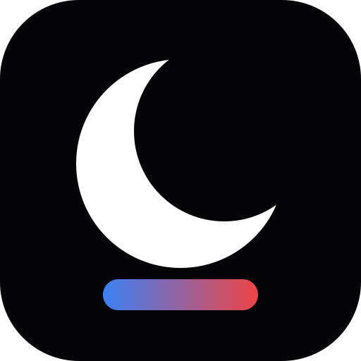
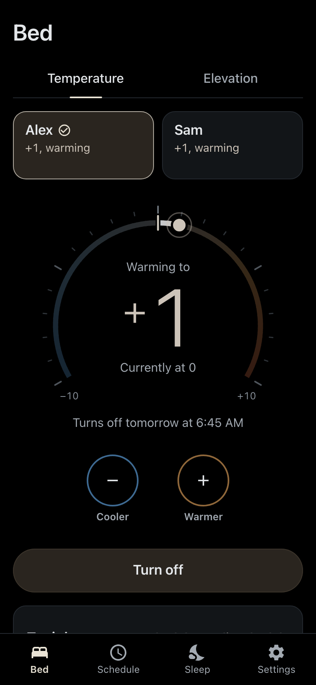
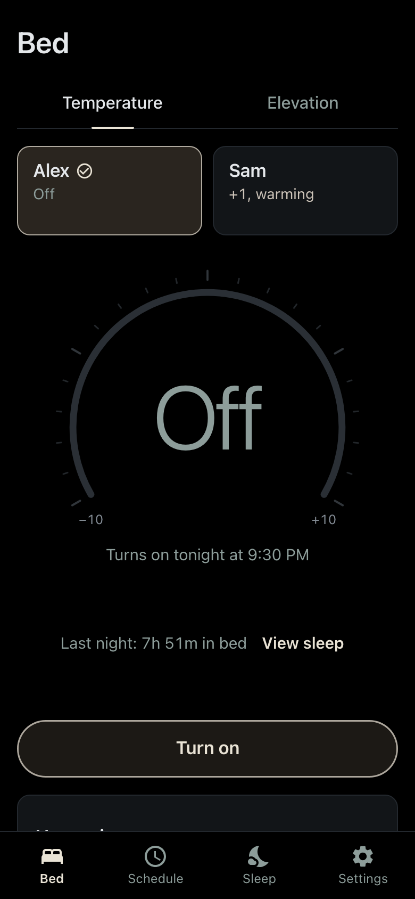
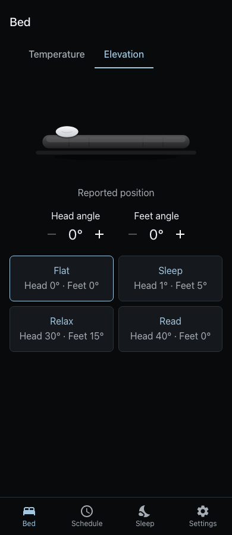
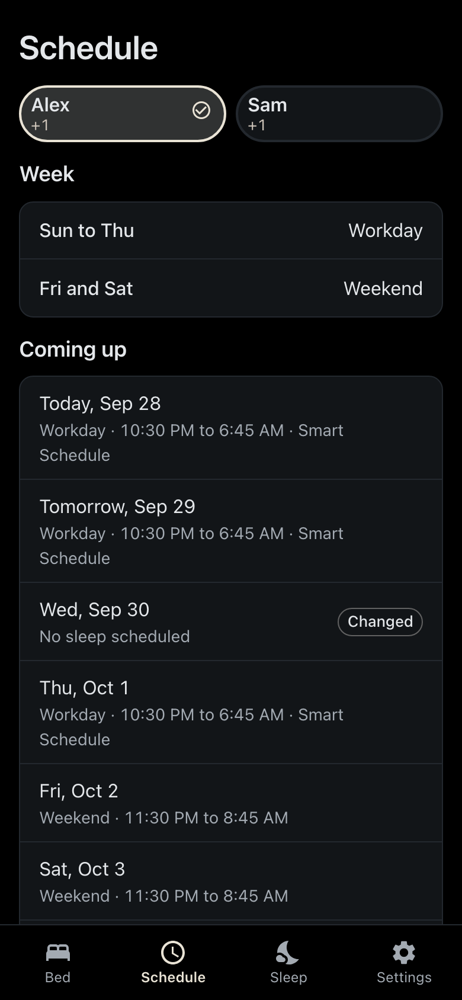
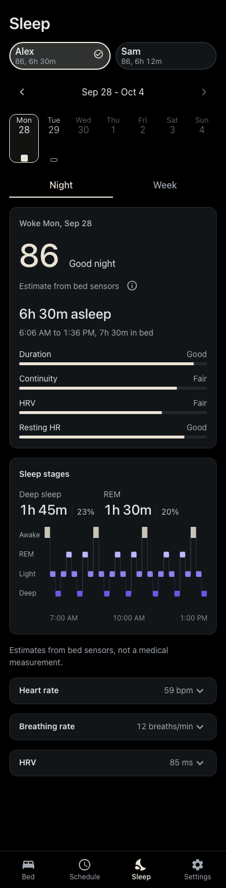
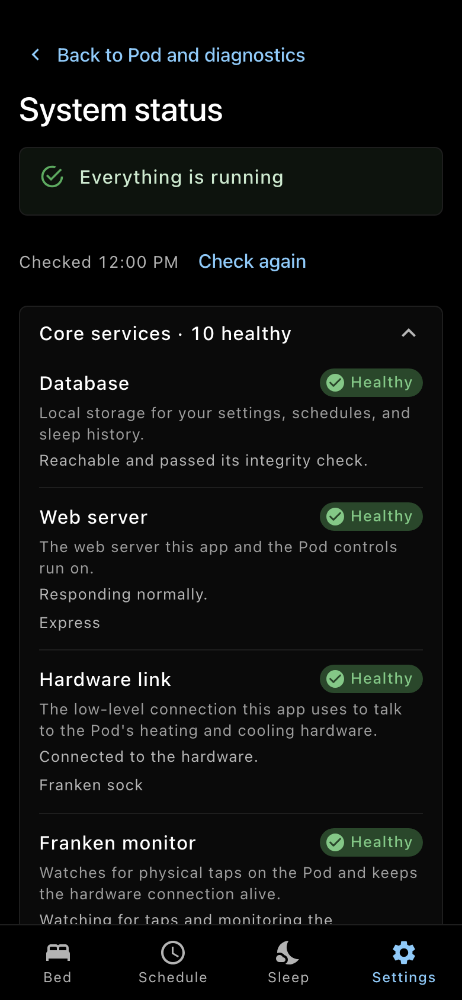
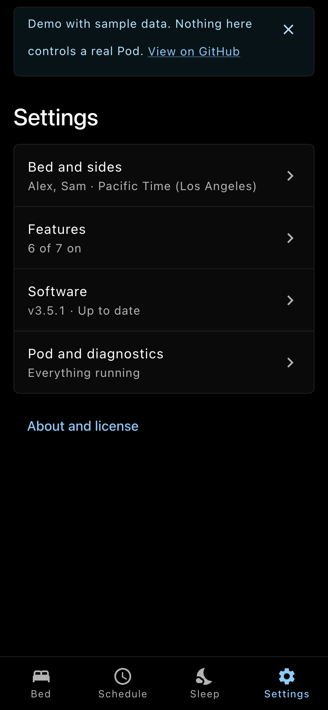

<p align="center">
  
</p>

<h1 align="center">Nightstand</h1>

<p align="center"><b>Local control for Eight Sleep Pods, without the Eight Sleep app or subscription.</b></p>

<p align="center">
  <a href="LICENSE.md"></a>
  <a href="CHANGELOG.md"></a>
</p>

Nightstand runs on the Linux computer inside compatible Eight Sleep Pods,
providing local temperature controls, schedules and optional sleep estimates.
It is a personal fork of free-sleep through jmew's fork, maintained on a Pod 5.
See the compatibility table for other models and the biometrics notes for
measurement limits.

<p align="center">
  
  &nbsp;&nbsp;
  
</p>

**[Try the live demo](https://ltimothy.github.io/nightstand/)**: the full app
running in your browser against sample data, with nothing to install.

Nightstand is not affiliated with, endorsed by, or supported by Eight Sleep,
Inc. "Eight Sleep" and "Pod" are used only to identify compatible devices.

## Compatibility

The maintainer tests Nightstand on a Pod 5. Pod 3 and Pod 4 support comes
from upstream free-sleep; this fork's biometrics and base controls have not
been tested on those models.

| Pod | Temperature and schedules | Biometrics | Adjustable base |
| --- | --- | --- | --- |
| Pod 1, Pod 2 | Not supported | Not supported | Not supported |
| Pod 3 (with SD card) | Upstream support; uses the [SD card method](INSTALLATION.md#compatibility) | Untested on this fork | Untested on this fork |
| Pod 3 (no SD card) | Upstream support; FCC ID `2AYXT61100001` | Untested on this fork | Untested on this fork |
| Pod 4 | Upstream support | Untested on this fork | Requires an adjustable base |
| Pod 5 | Tested by maintainer | Experimental estimates | Requires an adjustable base; no separate test report |
| Pod 6 | Unknown | Unknown | Unknown |

## About this fork

Nightstand is a personal fork of
[free-sleep](https://github.com/throwaway31265/free-sleep), by way of
[jmew's fork](https://github.com/jmew/free-sleep). Local control of the Pod
exists because of those projects, and most of the code here is theirs (see
[Credits](#credits)). free-sleep remains the main project and has the largest
user base.

I maintain Nightstand on my own Pod 5, mostly fixing issues I run into day to
day. Reports from owners of Pod 3 and Pod 4 are especially useful. Nightstand
has no error reporting or analytics; its browser checks versions on GitHub.
Daily use is local, with the [firewall exceptions](INSTALLATION.md#19-add-firewall-rules-to-block-internet-access-optional-but-recommended)
explained in the installation guide. In-app updates support release selection
and application rollback. Versions start at 3.0.0; upstream fixes are reviewed
and brought in by hand, so they may take time to appear here.

Already running another free-sleep fork? See
**[Coming from free-sleep](docs/COMING_FROM_FREE_SLEEP.md)**.

## Installing

Follow **[INSTALLATION.md](INSTALLATION.md)**. You'll need a Mac or Linux
computer and basic familiarity with a terminal. Most Pods require opening the
case and connecting a serial cable (about $70 in parts). Pod 3 with an SD card
doesn't need the cable; it uses a community SD card method, and the guide
explains where to pick up from there.

Once installed, the Pod serves the app on port 3000:

```
http://eight-pod.local:3000
```

If that address doesn't resolve (for example, the Pod was renamed or your
network doesn't support `.local` names), use the Pod's IP address from your
router instead: `http://<POD_IP>:3000`. Enter the address directly if the Pod
does not appear in Bonjour browsers.

Nightstand's API has no login: a device that can reach it can control the Pod
and access its data. Use a trusted local network, do not port-forward it to
the public internet, and restrict access if you enable Tailscale.

To add it to an iPhone home screen, open it in Safari, tap Share, then
**Add to Home Screen**. On Android, use Chrome's menu and choose
**Add to Home screen** or **Install app**. The app talks to the Pod directly,
so it keeps working during internet outages but isn't reachable away from home
unless you set up [remote access with Tailscale](docs/REMOTE_ACCESS.md).

## Features

- Temperature control in °F, °C, or the official app's -10 to +10 scale,
  with live updates
- Schedules for power on and off, overnight temperature changes, daily
  priming, and alarms with vibration patterns
- Sleep and health data: heart rate, HRV, breathing rate, movement, sleep
  stages, and a sleep score (see [Biometrics](#biometrics) for accuracy)
- Adjustable-base controls on compatible hardware, with presets and manual
  positioning; see the model table for test status
- Away mode, LED brightness, and time zone settings
- Daily controls and schedules work locally. Installation, update downloads
  and version checks use the internet; optional remote access uses Tailscale.

### What you can turn off

In Settings:

- **Biometrics** under Features: off by default, and needs a one-time install (see below).
- **Sleep score and stages** under Features: needs biometrics.
- **Presence auto-off** under Features: on by default, and needs biometrics. Turns a side off
  after 45 minutes with no one on it, outside its scheduled on-window.
- **Level temperature display** and
  **one-time alarms** under Features: on by default.

Next to daily priming, the restart an hour before priming is on by default and
only runs while priming is on.

### Biometrics

Biometrics is experimental. The original free-sleep project compared heart-rate
estimates with reference devices across 33 nights from six people.
That comparison does not validate Nightstand's later changes. HRV, breathing
rate, sleep stages and sleep score have not been validated here and may be
inaccurate. This fork is developed on a Pod 5; its biometrics have not been
checked on Pod 3 or Pod 4. The [biometrics reference](biometrics/BIOMETRICS.md#upstream-heart-rate-comparison)
has the original comparison and its source.

Biometrics is off by default and requires a one-time install. On the Pod
over SSH:

```bash
sh /home/dac/free-sleep/scripts/enable_biometrics.sh
```

After that, it can be turned on and off under Settings > Features.

Data is stored on the Pod in `/persistent/free-sleep-data/free-sleep.db` and
is available from `http://<POD_IP>:3000/api/metrics/vitals`. See
[biometrics/BIOMETRICS.md](biometrics/BIOMETRICS.md) for details.

## Updating

Updates are under Settings > Software. The updater saves
application code, SQLite data and settings before replacing the code. It
checks the running version, a device-status temperature reading and that the
server service is active, and attempts an application rollback if installation
fails. Check the running version and your usual controls after it returns;
the startup check covers only the signals above.

`fs-update` over SSH uses the same updater and saved channel preference.
Stable selects stable releases; beta includes both channels. A new install
saves stable as its preference, but the installation script downloads `main`,
which may contain a beta. Choose a release in Settings to change versions.
Installing another release replaces the immediate rollback slot. Application
rollback restores code, not an earlier database or the Eight Sleep firmware.

## FAQ

### Can I go back to the Eight Sleep app?

A firmware reset restores Eight Sleep's stock software. Follow the procedure
for your model in [How to revert](INSTALLATION.md#how-to-revert-changes-and-go-back-to-using-your-eight-sleep-through-their-app).
Pod 5 reset steps are not documented here yet. Switching to upstream
free-sleep from Settings installs another community application; it does not
restore Eight Sleep software.

### Could I brick my Pod?

I'm not aware of any bricked Pods on Pod 3 without an SD card, Pod 4, or
Pod 5. There are fewer reports for Pod 3 with an SD card, which uses a
different install method. If an install goes wrong, a firmware reset restores
the stock software. Read the
[reset instructions for your model](INSTALLATION.md#how-to-revert-changes-and-go-back-to-using-your-eight-sleep-through-their-app)
before installing; Pod 5 reset steps are not documented here yet. Proceed
at your own risk.

### What happens if an install fails?

The updater and migration tool keep backups and try to restore the previous
application when startup fails. Recovery can still require SSH or a
[model-specific firmware reset](INSTALLATION.md#how-to-revert-changes-and-go-back-to-using-your-eight-sleep-through-their-app),
so check that procedure before installing. Schedules and alarms pause while
Nightstand's server is stopped.

### Will it void my warranty?

Eight Sleep does not support Nightstand. Check the warranty terms for your
Pod before installing.

### Where can I get help?

[Open an issue](https://github.com/LTimothy/nightstand/issues) with your Pod
model, Nightstand version, expected and actual behavior, and steps to reproduce.
For service or installation problems, `fs-debug` on the Pod over SSH can help.
Check the report before posting it publicly and remove any personal or
network details you do not want to share. If the problem also exists in the
original project, consider reporting it there as well.

## Contributing

See [CONTRIBUTING.md](CONTRIBUTING.md). Pull requests go to the `dev` branch.
There are separate notes for the [app](app/README_APP.md) and the
[server](server/README_SERVER.md).

## Credits

Nightstand builds on reverse-engineering work that others made public:

- [throwaway31265](https://github.com/throwaway31265/free-sleep) built the
  original project: the installer, the server, the app, and the biometrics
  pipeline.
- [jmew](https://github.com/jmew/free-sleep) built the fork this one is based
  on, adding presence detection, sleep stages, one-time alarms, adjustable base
  control, and live updates in the app.
- [@bobobo1618](https://github.com/bobobo1618) worked out how the Pod is
  controlled through `dac.sock`, which everything here depends on.

Smaller contributions are credited where they are used, in the
[changelog](CHANGELOG.md) and the docs.

## Related projects

Nightstand is one of several projects for running a Pod locally. If it isn't
the right fit, one of these may be:

- [free-sleep](https://github.com/throwaway31265/free-sleep), the original
  project, with the largest user base.
- [jmew/free-sleep](https://github.com/jmew/free-sleep), the fork Nightstand
  is based on.
- [sleepypod](https://github.com/sleepypod/core), an independent
  local-control project with a Next.js web app (AGPL-3.0) and an
  [iOS app](https://github.com/sleepypod/ios).
- [Lunaris](https://github.com/Schluggi/lunaris), firmware for the Pod built
  around Home Assistant and MQTT, forked from LiamSnow/opensleep.
- [hass-free-sleep](https://github.com/Mrtenz/hass-free-sleep), a Home
  Assistant integration for free-sleep.

If a project is missing, please open an issue.

## License

MIT, unchanged from the original project. [LICENSE.md](LICENSE.md) has the
full text and the original project's disclaimer. The software comes with no
warranty.

## Screenshots

These screenshots use sample data and show the Bed, Schedule, Sleep and
Settings layout. The hosted [demo](https://ltimothy.github.io/nightstand/)
follows the published release and may differ from this checkout.

<details>
<summary>Adjustable base</summary>

</details>
<details>
<summary>Schedules and alarms</summary>

</details>
<details>
<summary>Sleep stages, sleep score, and health metrics</summary>

</details>
<details>
<summary>System status</summary>

</details>
<details>
<summary>Settings</summary>

</details>
