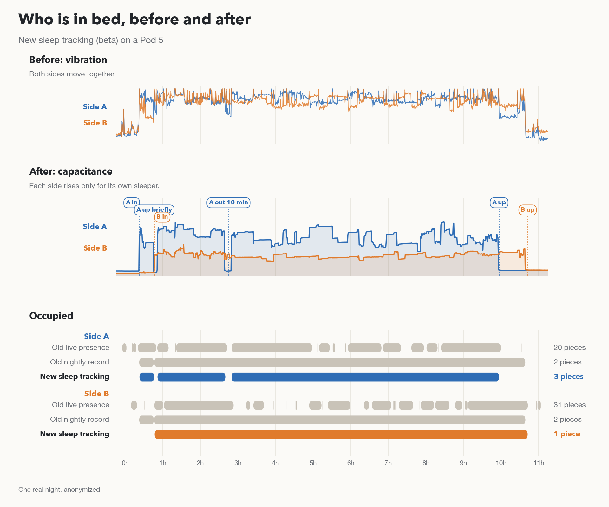

# How the sleep numbers were checked

This page says how I checked Nightstand's sleep features, the numbers I got
and how many people and nights they rest on, what didn't pass, and what I
haven't checked at all. Everything here is an estimate from bed sensors, not
a medical measurement, so please don't use it for health decisions.

## In short

- I have one Pod 5, in one bed, with two sleepers. That is enough to catch
  large problems. It is not a study, and the numbers may not hold for other
  people, mattresses or Pod models.
- Heart rate, breathing and HRV were scored against reference devices only on
  a public dataset (Li et al., 2024), recorded with a different sensor under
  the mattress and one sleeper per bed. Nobody has worn a reference device on
  my Pod.
- Presence with New sleep tracking was compared with both sleepers' own notes
  over seven nights.
- Sleep stages and the sleep score haven't been compared with anything.

| What | Checked against | Result |
| --- | --- | --- |
| Heart rate, default tracking | Chest strap, public dataset, 22 people | Off by about 2.8 bpm on average |
| Heart rate, New sleep tracking | Same | Off by about 1.3 bpm, with a value for fewer minutes |
| Breathing rate, New sleep tracking | Breathing belt, public dataset, 22 people | Off by about 0.4 breaths per minute |
| Breathing rate, default tracking | Same | No better than a fixed guess, so not shown |
| HRV | Chest strap, public dataset | Missed a bar set before testing, so not shown |
| Presence, New sleep tracking | Both sleepers' notes, 7 nights, one Pod 5 | Within 9 minutes on every night but one |
| Sleep stages and score | Nothing | Not validated, not shown |

bpm is beats per minute.

## The public dataset

Li et al. (2024) recorded healthy adults aged 19 to 27 sleeping alone on a
mattress with a vibration sensor underneath, while they wore a Polar chest
strap or a breathing belt. 22 people wore the strap (42 nights) and 22 wore
the belt (53 nights); they weren't all the same people, so heart rate and
breathing were never scored on the same person. I ran Nightstand's estimators
on that sensor's signal and compared them with the strap and the belt, in
60-second windows for heart rate and breathing and 5-minute windows for HRV.

This tests whether an estimator can read a heartbeat from a bed sensor at
all. It can't test a Pod's own sensor, which sits in the cover on top of the
mattress, or what a second sleeper or the Pod's pump does to the signal.

While preparing the data, the sensor values as published appeared to have
lost the upper byte of some samples. I corrected for this before scoring by
choosing, for each affected sample, the value closest to its neighbours. My
first run, before the correction, made every method look much worse; those
numbers aren't used anywhere.

## Heart rate

| On the public dataset | Default tracking | New sleep tracking |
| --- | --- | --- |
| Average error | 2.8 bpm (95% interval 2.5 to 3.1) | 1.3 bpm |
| Minutes with a value | all | about 84% |
| Within 3 bpm of the strap | 69% of minutes | 90% of minutes |
| Range across people | 1.8 to 3.9 bpm | about 0.9 to 2.2 bpm |

For comparison, guessing each person's own average heart rate for every
minute would be off by 4.4 bpm, and guessing one number for everyone by 7.4.
The interval comes from resampling people.

The newer estimator was built partly on this dataset. On six people held
back from that work, its error was about 1.2 bpm. It reads about 1 bpm low
on average, mostly in minutes with movement or waking, and it leaves a
minute blank when the minute has too much movement or its estimates
disagree. Rates above 100 bpm are essentially untested, because the dataset
has only a handful of such minutes.

On my Pod, with New sleep tracking, about three quarters of in-bed minutes
got a heart rate. With no reference there, the only checks I can make are
agreement between two of my own methods, which is weaker evidence than a
reference, so I don't quote those as accuracy.

## Breathing rate

With New sleep tracking, breathing rate was off by about 0.4 breaths per
minute against the breathing belt (correlation 0.97), and about the same on
the people held back from development. It gives a value for about two
thirds of minutes and leaves the rest blank.

The default tracking's breathing estimate was off by about 2.7 breaths per
minute, while guessing one number for everyone would be off by 2.5. Because
it was no better than that guess, the app doesn't show it; with New sleep
tracking on, the app shows the newer estimate.

## HRV

HRV (heart rate variability) needs the timing of each heartbeat, which a bed
sensor sees much less clearly than a chest strap.

- The default tracking's estimate (SDNN) was off by 41.9 ms on average,
  worse than guessing one number for everyone (30.2 ms) or each person's own
  average (24.8 ms).
- For the newer estimate, I wrote down a bar before testing it: on people
  held back from development, RMSSD within 8 ms on average and reading no
  more than 3 ms high or low overall. Each candidate was scored on those
  people once. The best was off by 8.7 ms and read 4.5 ms high, with a value
  for about a fifth of the windows. It missed the bar.

So the app shows no HRV. Both estimates are still stored, and the newer one
is used only to keep evaluating.

## Presence with New sleep tracking

On a Pod 5 whose cover writes the newer capacitance records, New sleep
tracking decides who is in which side from the capacitance sensor under each
side. I checked it over seven nights on my Pod 5 with two sleepers. Each of
us kept our own notes of when we got into and out of bed, and I compared the
Pod's entry and exit times for each side with those notes: 22 noted entries
and exits in all.

- The median difference was 0.6 minutes.
- On every night but one, every entry and exit was within 9 minutes of the
  notes.
- The exception was one morning when a note was 27 minutes earlier than the
  Pod. The sleeper had got up but was folding the blankets on the bed, so
  the bed was still in use. The Pod counted that as in bed and recorded heart
  rate for a few of those minutes. I count it as a miss: New sleep tracking
  can't tell lying in bed from moving about on top of it.

Over the same nights, the old tracking split each side's night into many
short pieces, and New sleep tracking kept each side's night whole.

One of those nights, old tracking against new. The labels come from New
sleep tracking, not from the notes.

Heart rate, breathing, stages and the score weren't part of this check.
Other Pod models, other households, and a Pod 5 with the older capacitance
records haven't been checked; there the switch is experimental.

## Two people in one bed

The two halves of the Pod aren't mechanically separate, so one sleeper's
heartbeat reaches the other side's sensor as a weaker echo.

- **One side empty, the other occupied.** With New sleep tracking, a side's
  heart rate and breathing are recorded only while that side reads as
  occupied. In the minutes on my Pod where one side was empty and the other
  wasn't, it recorded nothing for the empty side (0 of 215 minutes); the
  heart-rate estimator on its own would have given a value, usually the other
  sleeper's, in about 45% of them. With the default tracking, an empty side
  can read as occupied and carry the partner's values.
- **Both in bed.** The two sides read the same heart rate, within 1 bpm, in
  about 15% of minutes, against about 11% expected by chance, over about
  1,200 minutes. That suggests one side sometimes picks up the other's
  heartbeat. Nightstand has a rule meant to keep a shared heartbeat on the
  side it belongs to, but my checks couldn't show that it picks the right
  side. I treat this as a known limit: telling two sleepers' heartbeats apart
  needs a reference worn by each of them.

## Sleep stages, time asleep and the sleep score

Neither has been compared with a sleep study, a wearable or any other
reference. The stage rules gave every night roughly the same shares of deep
sleep and REM, so the app doesn't show them. The rule for when sleep starts
counted 1.3 to 4 hours at the start of the night as awake on 10 of 16 nights
from my Pod (each side counted separately), so the app shows time in bed
instead. The sleep score isn't shown for now: without an estimate of time
asleep it only reflected time in bed and trips out of bed. It's still in the
API.

## Smart Schedule

Smart Schedule's timings are my own estimates. With Biometrics on, the
cool-down starts once you have been in bed for 20 minutes, but not before
bedtime. If presence isn't reporting, it starts at bedtime, or when reporting
stops if that is later. Either way it starts no more than two hours after
bedtime. "When I get up" turns a side off about 10 minutes after you get
up, at most 3 hours past the scheduled off time. The Pod's own off timer is
set 15 minutes past the scheduled off time and, while the side is kept on
after it, stays at most 15 minutes ahead, so the side still turns off if
Nightstand stops. A pause moves that timer to the latest off time.

These rules are covered by automated tests ([TESTING.md](TESTING.md)). I
haven't checked whether the curve changes anyone's sleep, I haven't measured
how long the cover takes to reach a new temperature. I checked "When I get up"
on my Pod 5: the side stayed on while I was in bed and turned off after I got
up, and its firmware timer turned it off with the server stopped. The studies
listed in the app used other beds and didn't test this curve. Both features
rely on presence, which in a shared bed can mistake the other sleeper for you.

## Limits

- One Pod 5, one household, two sleepers, seven nights of notes.
- The public dataset is healthy young adults, one per bed, on a different
  sensor. Older adults, people with heart conditions, and very low or high
  heart rates aren't represented.
- No reference device has been worn on a Pod, so there is no accuracy figure
  for a Pod.
- In a shared bed, one side can carry the other sleeper's heart rate.
- The newer estimators' CPU and memory use was measured on a computer, not
  on a Pod.

What would change these conclusions: chest-strap or watch nights on a Pod
with both sides occupied, notes from Pod 3, Pod 4 and Pod 6 owners, and any
night where New sleep tracking misses a real exit or invents one.

## How these numbers were made

I write much of Nightstand with AI coding tools, and the analysis here was
done the same way, offline on copies of the data. Nothing was tested by
sending commands to the bed. Where a design was tuned on the public dataset,
I report its result on people it wasn't tuned on as well.

## Data and credits

- Li, Yong-Xian; Huang, Jiong-Ling; Yang, Zhao-Yang; Shen, Yan-Fei (2024).
  *A ballistocardiogram dataset with reference sensor signals in long-term
  natural sleep environments.* figshare.
  https://doi.org/10.6084/m9.figshare.26013157.v1, licensed
  [CC BY 4.0](https://creativecommons.org/licenses/by/4.0/). Paper: Li, Y.-X.,
  Huang, J.-L., Yao, X.-Y. et al., *Scientific Data* 11, 1091 (2024),
  https://doi.org/10.1038/s41597-024-03950-5. Changes made before scoring:
  the sample correction described above, aligning the sensor and reference
  clocks, and splitting into windows. The dataset isn't redistributed here;
  only my scores are.
- Upstream [free-sleep](https://github.com/throwaway31265/free-sleep)
  compared its own heart-rate estimate with reference devices over 33 nights
  from six people; its table is in the
  [biometrics reference](../biometrics/BIOMETRICS.md#upstream-heart-rate-comparison).
  It covers that code, not Nightstand's later changes.
